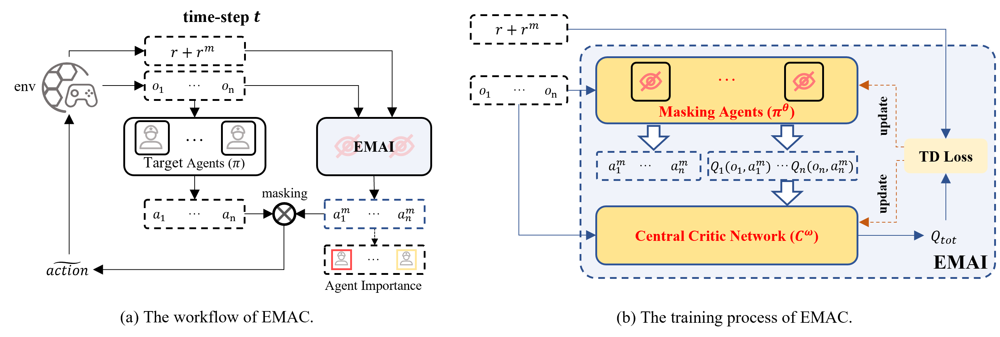

# <font size=6>EMAI</font>
This repository contains the source code for the paper: **Understanding Individual Agent Importance in Multi-Agent Reinforcement Learning via Counterfactual Reasoning**.

# Overview

We propose EMAI, a novel agent-level **E**xplanation approach for the **MA**S which pinpoints the **I**mportance of each individual agent at every time-step (i.e., state). 

The overview of EMAI is shown in the figure below:


# Environment Setup
Our experiments are conducted on three popular multi-agent benchmarks with different characteristics as follows.

## Required Environment 

- [StarCraftII (SMAC)](https://github.com/oxwhirl/smac)
- [Multiagent Particle-World Environments (MPE)](https://github.com/openai/multiagent-particle-envs)
- [Google Research Football (GRF)](https://github.com/google-research/football)

## Installation instructions
Install Python packages

```shell
# require Anaconda 3 or Miniconda 3
conda install pytorch==1.7.1 torchvision==0.8.2 torchaudio==0.7.2 cudatoolkit=10.1 -c pytorch -y
pip install protobuf==3.19.5 sacred==0.8.2 numpy scipy gym==0.11 matplotlib \
    pyyaml==5.3.1 pygame pytest probscale imageio snakeviz tensorboard-logger

# Even though we provide requirement.txt, it may have redundancy. We recommend to install other required packages by running the code and finding which required package hasn't installed yet.

```

Set up SMAC:

```shell
bash install_sc2.sh

This will download SC2.4.10 into the 3rdparty folder and copy the maps necessary to run over.
```

Set up GRF:

```shell
bash install_gfootball.sh
```

Set up MPE:

```shell
# install this package first
pip install seaborn
```

# Running
## Train the target agents
```
### SMAC:

## SMAC-1c3s5z
bash scripts/train/train_smac_1c3s5z.sh

## SMAC-27m_vs_30m
bash scripts/train/train_smac_27m_vs_30m.sh

## SMAC-8m
bash scripts/train/train_smac_8m.sh

####################################

### GRF:

## GRF-counter_attack
bash scripts/train/train_grf_counter_attack.sh

## GRF-3vs1_with_keeper
bash scripts/train/train_grf_3vs1_with_keeper.sh

####################################

### MPE:

## MPE-spread
bash scripts/train/train_mpe_spread.sh

## MPE-reference
bash scripts/train/train_mpe_reference.sh
```

## Train the masking agents
```
### SMAC:

## SMAC-1c3s5z
bash scripts/train/train_smac_1c3s5z_mask.sh

## SMAC-27m_vs_30m
bash scripts/train/train_smac_27m_vs_30m_mask.sh

## SMAC-8m
bash scripts/train/train_smac_8m_mask.sh

####################################

### GRF:

## GRF-counter_attack
bash scripts/train/train_grf_counter_attack_mask.sh

## GRF-3vs1_with_keeper
bash scripts/train/train_grf_3vs1_with_keeper_mask.sh

####################################

### MPE:

## MPE-spread
bash scripts/train/train_mpe_spread_mask.sh

## MPE-reference
bash scripts/train/train_mpe_reference_mask.sh
```

## Evaluation
```
### SMAC:

## SMAC-1c3s5z
bash scripts/eval/eval_smac_1c3s5z.sh

## SMAC-27m_vs_30m
bash scripts/eval/eval_smac_27m_vs_30m.sh

## SMAC-8m
bash scripts/eval/eval_smac_8m.sh

####################################

### GRF:

## GRF-counter_attack
bash scripts/eval/eval_grf_counter_attack.sh

## GRF-3vs1_with_keeper
bash scripts/eval/eval_grf_3vs1_with_keeper.sh

####################################

### MPE:

## MPE-spread
bash scripts/eval/eval_mpe_spread.sh

## MPE-reference
bash scripts/eval/eval_mpe_reference.sh
```

# Visualization
We have marked the most important agents found by EMAI in the video playback.

The videos are available in the directory: ```replays/```

# Reference
- https://github.com/hijkzzz/pymarl2/
- https://github.com/marlbenchmark/on-policy/